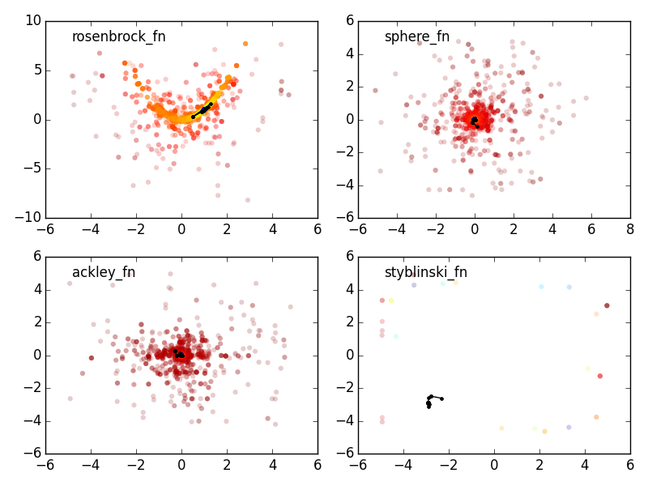

.. fitting line sandbox documentation master file, created by
   sphinx-quickstart on Fri Feb 20 15:15:04 2015.
   You can adapt this file completely to your liking, but it should at least
   contain the root `toctree` directive.

Differential evolution (DE)
===========================

This implements only a single class: `DiffEvolOptimizer` that follows the
differential evolution optimization method by Storn & Price (Storn, R., Price,
K., Journal of Global Optimization 11: 341--359, 1997, `DE original paper`_)

**Main assuption**: the heuristic suppose a continuous parameter space.

About Differential Evolution
----------------------------

DE is a method that searches optima of a function iteratively trying to improve
a candidate solution with regard to a given measure of quality. Such methods are
commonly known as metaheuristics as they make few or no assumptions about the
problem being optimized and can search very large spaces of candidate solutions.
However, metaheuristics such as DE do not guarantee an optimal solution is ever
found.

DE is used for multidimensional functions but does not use the gradient itself,
which means DE does not require the optimization function to be differentiable,
in contrast with classic optimization methods such as gradient descent and
newton methods. 

DE can therefore also be used on optimization problems that are not even
continuous, are noisy, change over time, etc.

DE works like a swam optimization problem. It maintains a population of
candidate solutions and creating new candidate solutions by combining existing
ones (with a simple prescription), and then keeping whichever candidate solution
has the best score or *fitness*. The optimizer treats therefore the problem as a
black box and thus does not require knowledge of the gradient.

Practical Advice
----------------

This is taken from Storn's website (`Differential Evolution homepage`_)

If you are going to optimize your own objective function with DE, you may try
the following classical settings.

* The size of the population of about 10 times the number of parameters

* the weighting factor F=0.8 (in general F=0.5-0.8 works best)

* the cross-over probability C=0.5. Use 0.9 to test fast convergence and smaller
  values for elaborate search.

* It has been found recently that selecting F from the interval [0.5, 1.0]
  randomly for each generation or for each difference vector, a technique called
  *dither*, improves convergence behaviour significantly, especially for noisy
  objective functions. 

* It has also been found that setting C to a low value, e.g. C=0.2 helps
  optimizing separable functions since it fosters the search along the
  coordinate axes. On the contrary this choice is not effective if parameter
  dependence is encountered, something which is frequently occuring in
  real-world optimization problems rather than artificial test functions. So for
  parameter dependence the choice of C=0.9 is more appropriate. 

* Another empirical finding is that rasing npop above, say, 40 does not
  substantially improve the convergence, independent of the number of
  parameters. It is worthwhile to experiment with these suggestions. Make sure
  that you initialize your parameter vectors by exploiting their full numerical
  range, i.e. if a parameter is allowed to exhibit values in the range [-100,
  100] it's a good idea to pick the initial values from this range instead of
  unnecessarily restricting diversity.

.. note::

        Keep in mind that different problems often require different settings for N, F and C 
        
        A good objective function can make all the difference.

Relevants links/images
----------------------

* `Differential Evolution homepage`_
* `DE original paper`_ 

.. _Differential Evolution homepage: http://www1.icsi.berkeley.edu/~storn/code.html
.. _DE original paper: https://bitbucket.org/12er/pso/src/b448ff0db375c1ac0c55855e9f19aced08b44ca6/doc/literature/heuristic%20Search/Differential%20Evolution%20-%20a%20simple%20and%20efficient%20heuristic%20for%20global%20optimization%20over%20continuous%20spaces.pdf

Example
-------

.. code:: python

        def rosenbrock_fn(x):
            """ Rosenbrock function
                global minimum at x = [1, ..., 1], f(x) = 0
            """
            _x = np.array(x)
            return sum(100.0 * (_x[1:] - _x[:-1] ** 2) ** 2. + (1 - _x[:-1]) ** 2.)

        # setup the optimization
        ngen, npop, ndim = 100, 100, 2
        limits = [[-5, 5]] * ndim
        de = DiffEvolOptimizer(rosenbrock_fn, limits, npop)

        # store all the values during iterations for plotting.
        pop = np.zeros([ngen, npop, ndim])
        loc = np.zeros([ngen, ndim])
        for i, res in Pbar(ngen).iterover(enumerate(de(ngen))):
            pop[i,:,:] = de.population.copy()
            loc[i,:] = de.location.copy()

        # plot all explored points
        ax.scatter(pop[:, :, 0].ravel(), pop[:, :, 1].ravel(),
                   c=np.log10(vals + 1e-20), alpha=0.2, edgecolor='None')
        # plot the final positions
        plt.plot(loc[:, 0], loc[:, 1], 'k.-')

        plt.show()

**Testing multiple common functions**
(code included in `test.py`)

API
===

.. automodule:: de
    :members:

Indices and tables
==================

* :ref:`genindex`
* :ref:`modindex`
* :ref:`search`

